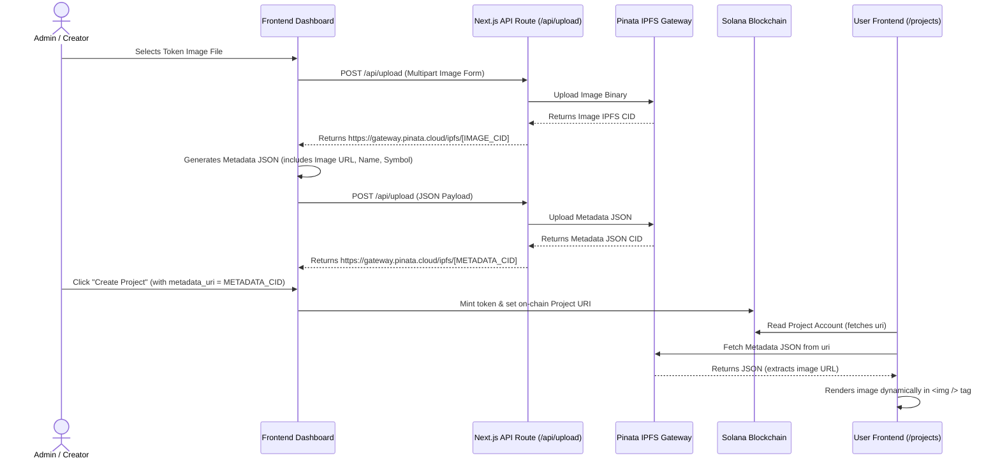

# Guide: Uploading and Rendering Token Images via Pinata IPFS

This guide explains how to upload token images and metadata to **Pinata IPFS** and display them dynamically in the **Aurumchain** frontend.

Since Aurumchain is built on **Solana**, standard blockchain explorers (like Solana Explorer, Solscan) and wallet interfaces (like Phantom) expect token images to be defined inside a **metadata JSON file** conforming to the Metaplex/ERC-721 token metadata standard. The on-chain `uri` points to this JSON file.

Here is the full architecture and implementation flow.

---

## ── Architectural Overview ──



---

## Step 1: Create a Next.js API Route for Pinata Uploads

Since your `.env` already has the `PINATA_JWT_TOKEN` configured, you can create a secure server-side API route that interacts with Pinata. This protects your JWT from being exposed on the client side.

Create the file `app/api/upload/route.ts`:

```typescript
import { NextRequest, NextResponse } from "next/server";

export async function POST(req: NextRequest) {
  try {
    const contentType = req.headers.get("content-type") || "";

    // ── Scenario A: Uploading raw JSON metadata ──
    if (contentType.includes("application/json")) {
      const body = await req.json();

      const response = await fetch("https://api.pinata.cloud/pinning/pinJSONToIPFS", {
        method: "POST",
        headers: {
          "Content-Type": "application/json",
          Authorization: `Bearer ${process.env.PINATA_JWT_TOKEN}`,
        },
        body: JSON.stringify({
          pinataContent: body,
          pinataMetadata: {
            name: `${body.name || "token"}-metadata.json`,
          },
        }),
      });

      if (!response.ok) {
        throw new Error(await response.text());
      }

      const result = await response.json();
      return NextResponse.json({
        success: true,
        ipfsHash: result.IpfsHash,
        url: `https://gateway.pinata.cloud/ipfs/${result.IpfsHash}`,
      });
    }

    // ── Scenario B: Uploading Multipart Image Form ──
    if (contentType.includes("multipart/form-data")) {
      const formData = await req.formData();
      const file = formData.get("file") as File;

      if (!file) {
        return NextResponse.json({ error: "No file provided" }, { status: 400 });
      }

      // Convert file to buffer for pinning API
      const arrayBuffer = await file.arrayBuffer();
      const buffer = Buffer.from(arrayBuffer);

      const pinataFormData = new FormData();
      const blob = new Blob([buffer], { type: file.type });
      pinataFormData.append("file", blob, file.name);

      const response = await fetch("https://api.pinata.cloud/pinning/pinFileToIPFS", {
        method: "POST",
        headers: {
          Authorization: `Bearer ${process.env.PINATA_JWT_TOKEN}`,
        },
        body: pinataFormData,
      });

      if (!response.ok) {
        throw new Error(await response.text());
      }

      const result = await response.json();
      return NextResponse.json({
        success: true,
        ipfsHash: result.IpfsHash,
        url: `https://gateway.pinata.cloud/ipfs/${result.IpfsHash}`,
      });
    }

    return NextResponse.json({ error: "Unsupported content type" }, { status: 400 });
  } catch (error: any) {
    console.error("[Pinata Upload Error]:", error);
    return NextResponse.json(
      { error: error.message || "Failed to upload to Pinata" },
      { status: 500 }
    );
  }
}
```

---

## Step 2: The Metaplex Token Metadata Standard

Solana tokens require a specific JSON structure to correctly show details on-chain. When uploading token details to Pinata, construct the JSON format as follows:

```json
{
  "name": "Gold Mining Project Token",
  "symbol": "GMP",
  "description": "Fractions of GMP production representing revenue distribution shares.",
  "image": "https://gateway.pinata.cloud/ipfs/QmImageIpfsHashFromPinata",
  "external_url": "https://aurumchain.io",
  "attributes": [
    {
      "trait_type": "Location",
      "value": "Nevada, USA"
    },
    {
      "trait_type": "Asset Type",
      "value": "Gold Mine"
    }
  ],
  "properties": {
    "files": [
      {
        "uri": "https://gateway.pinata.cloud/ipfs/QmImageIpfsHashFromPinata",
        "type": "image/png"
      }
    ],
    "category": "image"
  }
}
```

---

## Step 3: Frontend Upload Helper Function

Add an upload utility in your codebase to manage uploading the image first, grabbing the resulting URL, embedding it in the metadata JSON, and uploading the JSON itself.

Create the file `lib/utils/pinata.ts`:

```typescript
export interface TokenMetadata {
  name: string;
  symbol: string;
  description: string;
  image: string; // Will hold the image IPFS url
  properties?: {
    files: Array<{ uri: string; type: string }>;
    category: string;
  };
}

/**
 * Uploads a file (e.g. token image) to Pinata IPFS via server-side API.
 */
export async function uploadImageToIPFS(file: File): Promise<string> {
  const formData = new FormData();
  formData.append("file", file);

  const response = await fetch("/api/upload", {
    method: "POST",
    body: formData,
  });

  if (!response.ok) {
    const errorText = await response.text();
    throw new Error(`Image upload failed: ${errorText}`);
  }

  const data = await response.json();
  return data.url; // E.g., https://gateway.pinata.cloud/ipfs/Qm...
}

/**
 * Uploads standard Metaplex Token Metadata JSON to Pinata IPFS.
 */
export async function uploadMetadataToIPFS(metadata: TokenMetadata): Promise<string> {
  const fullMetadata = {
    ...metadata,
    properties: {
      files: [
        {
          uri: metadata.image,
          type: "image/png",
        },
      ],
      category: "image",
    },
  };

  const response = await fetch("/api/upload", {
    method: "POST",
    headers: {
      "Content-Type": "application/json",
    },
    body: JSON.stringify(fullMetadata),
  });

  if (!response.ok) {
    const errorText = await response.text();
    throw new Error(`Metadata upload failed: ${errorText}`);
  }

  const data = await response.json();
  return data.url; // This URL is your on-chain metadata_uri!
}
```

---

## Step 4: Add an Image & Metadata Uploader inside the Admin Panel

In `components/admin/ProjectsManagement.tsx`, you can add an upload interface inside the project creation form. This updates `formData.metadata_uri` automatically.

```typescript
// 1. Import helper methods:
import { uploadImageToIPFS, uploadMetadataToIPFS } from "@/lib/utils/pinata";

// 2. Inside the ProjectsManagement Component, add upload states:
const [uploading, setUploading] = useState(false);
const [selectedImage, setSelectedImage] = useState<File | null>(null);

// 3. Create the Handler:
const handlePinataUpload = async () => {
  if (!selectedImage) {
    alert("Please select an image first.");
    return;
  }

  setUploading(true);
  try {
    // A. Upload Image to Pinata
    const imageUrl = await uploadImageToIPFS(selectedImage);
    
    // B. Build Metadata
    const metadata = {
      name: formData.name || "Project Token",
      symbol: formData.token_symbol || "TKN",
      description: formData.description || "",
      image: imageUrl,
    };

    // C. Upload Metadata JSON to Pinata
    const metadataUrl = await uploadMetadataToIPFS(metadata);

    // D. Auto-populate form metadata_uri and image array
    setFormData((prev) => ({
      ...prev,
      metadata_uri: metadataUrl,
      images: [imageUrl, ...(prev.images || [])],
    }));

    alert("Success! Token Image and Metadata successfully pinned to IPFS.");
  } catch (err: any) {
    alert(`Failed to pin metadata: ${err.message}`);
  } finally {
    setUploading(false);
  }
};

// 5. Add JSX upload elements inside the form (before the Submit button):
<div className="glass p-5 rounded-xl border border-gold/20 mb-6">
  <h4 className="text-gold font-bold mb-3">Pinata Token Asset Manager</h4>
  <p className="text-xs text-gray-400 mb-4">
    Upload your Token image. This will automatically package your metadata JSON, host it on IPFS, and fill in the "Metadata URI" required on-chain.
  </p>
  <div className="space-y-4">
    <div>
      <label className="block text-sm text-gray-300 mb-1">Token Image</label>
      <input 
        type="file" 
        accept="image/*"
        onChange={(e) => setSelectedImage(e.target.files?.[0] || null)}
        className="w-full text-sm text-gray-400 file:mr-4 file:py-2 file:px-4 file:rounded-lg file:border-0 file:text-xs file:font-semibold file:bg-gold/20 file:text-gold hover:file:bg-gold/30"
      />
    </div>
    <button
      type="button"
      onClick={handlePinataUpload}
      disabled={uploading || !selectedImage}
      className="bg-gold text-navy px-4 py-2 rounded-lg font-bold hover:bg-gold-light transition-all disabled:opacity-50 text-sm"
    >
      {uploading ? "Uploading to IPFS..." : "Upload & Generate Metadata"}
    </button>
  </div>
</div>
```

---

## Step 5: Fetch and Display Token Images Dynamically in Frontend

In your frontend cards (like the `ProjectCard` inside `app/projects/page.tsx`), you can dynamically fetch the token's metadata JSON from the on-chain `uri` if it exists, and use the `image` field to display the token image!

Here is how to safely fetch it client-side with a simple React hook:

```typescript
import { useState, useEffect } from "react";

export function useIPFSMetadata(uri: string | null | undefined) {
  const [data, setData] = useState<{ image?: string; description?: string } | null>(null);
  const [loading, setLoading] = useState(false);

  useEffect(() => {
    if (!uri) {
      setData(null);
      return;
    }

    let active = true;
    setLoading(true);

    // Convert standard ipfs:// to HTTP gateway URL if needed
    const fetchUrl = uri.startsWith("ipfs://")
      ? uri.replace("ipfs://", "https://gateway.pinata.cloud/ipfs/")
      : uri;

    fetch(fetchUrl)
      .then((res) => (res.ok ? res.json() : null))
      .then((metadata) => {
        if (active && metadata) {
          setData(metadata);
        }
      })
      .catch((err) => console.warn(`Failed to fetch IPFS metadata from ${uri}:`, err))
      .finally(() => {
        if (active) setLoading(false);
      });

    return () => {
      active = false;
    };
  }, [uri]);

  return { data, loading };
}
```

### Usage inside `ProjectCard` in `app/projects/page.tsx`:

```tsx
const chain = project.onChain;
const { data: ipfsMetadata } = useIPFSMetadata(chain?.uri);

// Prefer Pinata on-chain token image, fallback to Supabase DB images, fallback to default placeholder
const displayImage = ipfsMetadata?.image || (project.images && project.images[0]) || "/logo.png";

// Rendering image:

```

Using this architecture, you gain a production-grade Web3 workflow that makes token images perfectly readable both by your **own frontend app** and on-chain tools/wallets!
