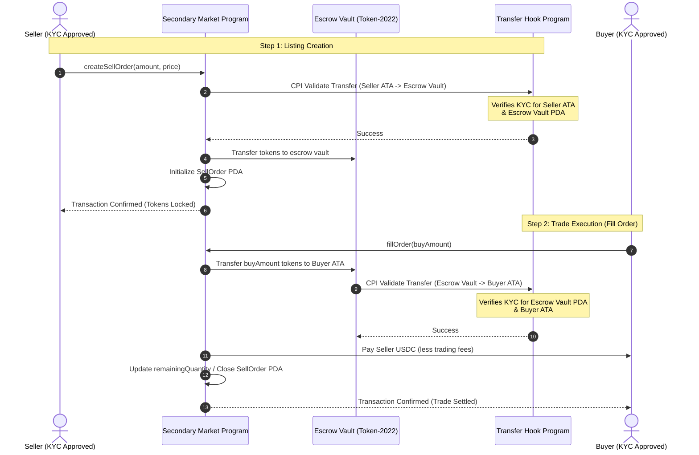

# AURUMCHAIN Secondary Market Documentation

This document provides a detailed technical overview of how the **Secondary Market (P2P Token Trading)** system is designed, implemented, and integrated within the AURUMCHAIN network.

---

## 1. Overview & Architecture

The Secondary Market allows investors to list, cancel, and trade project tokens in a decentralized, peer-to-peer (P2P) manner on Solana Devnet. The system consists of three main tiers:

1. **On-Chain Solana Contracts (Rust/Anchor):** Core trading logic, escrow safety, and fee processing.
2. **Web3 Services & Next.js UI:** Front-end portfolio integration, listing creation, and trade fulfillment modals.
3. **Off-Chain Real-Time Database Indexing:** A real-time watcher daemon and Next.js webhooks that parse on-chain events and index them into Supabase for instant frontend rendering.

### End-to-End P2P Flow Diagram



---

## 2. On-Chain Smart Contract Logic

The secondary market contract is located at `programs/secondary_market/` and is organized into modular instruction handlers.

### Key Program Accounts

- **Market Config PDA (`config`):** Derived from the `b"config"` seed. Stores global configurations (protocol authority, transaction fee percentage in basis points, registered program addresses, and global pause status).
- **Vault Authority PDA (`vault_authority`):** Derived from `b"vault_authority"`. Serves as the token authority for all escrow token accounts.
- **Project Account Mirror (`project_account`):** Read-only mirror account verifying that the project being traded is `Active` and has no active lockups in the Project Registry.
- **Escrow Vault PDA (`escrow_vault`):** Token account derived with seeds `[b"escrow_vault", project_mint]`. Holds escrowed tokens for a specific project.
- **Sell Order PDA (`sell_order`):** Unique order account derived with seeds `[b"sell_order", seller_pubkey, sequence]`. Stores order parameters (`seller`, `project_mint`, `original_quantity`, `remaining_quantity`, `price_per_token`, `sequence`, and `created_at`).

### Core Trading Actions

- **Listing (`createSellOrder`):** Initialized with a unique `sequence` (timestamp). Transfers tokens from the seller's associated token account (ATA) into the project's `escrow_vault` PDA.
- **Cancellation (`cancelSellOrder`):** Returns all remaining escrowed tokens to the seller's ATA and closes the `sell_order` account, returning lamports to the seller.
- **Trade Fills (`fillOrder`):** Supports partial fills. Transfers the requested token amount from the `escrow_vault` to the buyer's ATA. Deducts a protocol fee (e.g., 1.5%) in USDC, sends the fee to `fee_destination_usdc`, and routes the rest of the USDC to the seller's USDC account.

### Critical Serialization Fix (Error 3004)

When a sell order is fully filled, the program closes the `sell_order` account. In Anchor, declaring an account as mutable (`Account<'info, SellOrder>`) causes Anchor to serialize state back to the account upon program exit. Since the account is closed (0 bytes), this triggers `AccountDidNotSerialize` (3004).
To prevent this, the code reassigns the closed account's owner to the System Program upon deletion, bypassing Anchor's automatic checks:

```rust
order_info.realloc(0, false)?;
order_info.assign(&anchor_lang::solana_program::system_program::ID);
```

---

## 3. Web3 Services & UI Integration

The frontend interacts with the contracts using the `SecondaryMarketService` class defined in `lib/web3/services/secondaryMarketService.ts`.

### Account Resolution & Mismatch Fix

Because project tokens use Token-2022's Transfer Hook extension, any token movement triggers the compliance transfer hook program (`compliance_transfer`).
The client-side service resolves and appends the compliance metadata PDAs (`extra-account-metas`, `compliance_control`, `sender_eligibility`, `receiver_eligibility`, and `mint_lookup`) to the transaction.

> [!IMPORTANT]
> **Account Ordering Constraint:** The remaining accounts list passed to the `transfer_checked` instruction must match Token-2022 expectations exactly, with the transfer hook program ID (`COMPLIANCE_PROGRAM_ID`) placed at the very end. Placing it at index 0 will fail with `MissingAccount`.
> The correct ordering is:
> `[extraAccountMetaList, control, senderEligibility, receiverEligibility, mintLookup, COMPLIANCE_PROGRAM_ID]`

### User Interface Modals

- **ListTokenModal:** Opens from the user portfolio. Prompts for token amount and price per token in USDC, verifies KYC status, generates a unique sequence, and sends the transaction to create a listing.
- **BuyListingModal:** Opens from the marketplace. Prompts for purchase quantity, calculates fees/costs, verifies buyer compliance, and executes the fill order transaction.
- **Immediate Synchronization:** On transaction confirmation, the frontend directly calls the `/api/secondary-market/sync` hook to upsert database records, ensuring instant UI updates.

---

## 4. Compliance Transfer Hook Integration

### Why is KYC Registration Required?

The `compliance_transfer` program (the transfer hook contract) has a layout mismatch in how it derives investor compliance records. Instead of deriving the compliance PDA from the investor's wallet owner address, **the transfer hook derives it from the token account address itself**:

- **Sender Eligibility PDA** is derived using the `source_token` account address.
- **Receiver Eligibility PDA** is derived using the `destination_token` account address.

Because of this design, the transfer hook expects **both the sending token account and the receiving token account** to be registered as verified wallets in the compliance program.

### 1. For the Secondary Market Escrow Vault

Since each project/token has exactly one unique Escrow Vault PDA, you only need to run the admin registration once per project (when the project is created/activated).
Once the project's Escrow Vault PDA (`2AsHbqod9Ypm5bjHCUoZ6UeYsMz3vJskpGWeapzCqknL` for Cambridge School) is registered, all investors can transfer tokens to and from that vault.

### 2. For the Investor's ATA (Associated Token Account)

Because the hook checks the token account, the investor's project token ATA must also be registered in the compliance program. If the investor's ATA is not whitelisted, transfers will fail with a `SenderNotApproved` or `ReceiverNotApproved` on-chain error.

---

## 5. How to Simplify the Operational Burden

Manually whitelisting every single token account and platform escrow vault for every project adds a significant operational overhead. Below are strategies to eliminate this burden.

### Strategy A: Upgrade Transfer Hook Derivations

You can upgrade the `compliance_transfer` program code on-chain to derive the eligibility PDAs from the **owner wallets** instead of the token accounts.

In `transfer_hook.rs`, update `initialize_extra_account_meta_list` as follows:

1.  **Sender Eligibility:** Derive from index 3 (the owner/authority of the source token account).
2.  **Receiver Eligibility:** Since the SPL transfer instruction doesn't pass the receiver's wallet owner account directly, the hook would need to:
    - Load the destination token account data and parse the owner public key programmatically in the hook, OR
    - Skip receiver checks entirely for platform PDAs (like the Escrow Vault).

```rust
// In transfer_hook.rs - Proposed Upgrade
ExtraAccountMeta::new_with_seeds(
    &[
        Seed::Literal { bytes: b"eligibility".to_vec() },
        Seed::AccountKey { index: 3 }, // Source Owner (Wallet Address) instead of Index 0
    ],
    false,
    false,
)?
```

### Strategy B: Automatic Platform Escrow Bypass

Add a check in the transfer hook program to automatically bypass compliance verification if either the sender or the receiver is a platform escrow account:

- Verify if the owner of either the `source_token` or `destination_token` account is the secondary market program ID or its derived authority.
- If a match is found, skip KYC/AML checks, eliminating the need to manually register platform vault addresses in the compliance database.

# Secondary Market Payouts Fix

The current `Batch Payouts` system has a flaw regarding the secondary market:

1. It relies entirely on the on-chain `investmentSubscriptionAccount` to find investors. This completely ignores users who bought tokens on the secondary market.
2. The `execute_payout` smart contract instruction reads the live `investor_token_account.amount` to calculate the payout. Since listing tokens on the secondary market transfers them to an escrow vault, the seller's live balance drops, meaning they miss out on payouts for their listed tokens.

This plan aligns the system with the specification: _"Since tokens listed in `secondary_orders` remain inside the seller's total balance, the seller continues to receive 100% of their proportional dividend entitlement."_

## User Review Required

> [!WARNING]
> Because you manage your Solana Smart Contracts through **Solana Playground (Solpg)** and don't have Anchor CLI installed locally, **you will need to manually deploy the smart contract upgrade** after I write the code. I will handle all the local files and IDLs, but you must click "Build" and "Deploy" on Solpg.

## Proposed Changes

---

### Allocation Distribution Program (Smart Contract)

We need to modify the smart contract to accept a `snapshot_balance` parameter from the Admin, rather than solely relying on the live token account balance. This allows the admin to securely specify the exact total tokens the user owns (including those locked in escrow).

#### [MODIFY] [lib.rs](file:///c:/Rupom/Projects/AURUMCHAIN/programs/allocation_distribution/src/lib.rs)

- Update the `execute_payout` function signature to accept `snapshot_balance: u64`.

#### [MODIFY] [payout.rs](file:///c:/Rupom/Projects/AURUMCHAIN/programs/allocation_distribution/src/logic/payout.rs)

- Update `handle_execute_payout` to use the provided `snapshot_balance` instead of `investor_token_account.amount` for the dividend calculation.

---

### Backend & Frontend

We need to change where the admin UI gets the list of investors and how it calls the upgraded smart contract.

#### [MODIFY] [PayoutExecutionModal.tsx](file:///c:/Rupom/Projects/AURUMCHAIN/app/admin/distributions/PayoutExecutionModal.tsx)

- Change the data source from `complianceProgram.account.investmentSubscriptionAccount` to the Supabase `portfolio_positions` table.
- This will instantly include secondary market buyers, and correctly use `total_tokens` (which inherently includes `locked_tokens`).
- Update the Anchor RPC call to pass the `total_tokens` as the new `snapshotBalance` argument to `.executePayout(snapshotBalance)`.

#### [MODIFY] [allocation_distribution.json](file:///c:/Rupom/Projects/AURUMCHAIN/lib/web3/idl/allocation_distribution.json)

- Manually update the local IDL file to add the `snapshotBalance` argument to the `executePayout` instruction, ensuring the frontend doesn't crash before you deploy on Solpg.

## Verification Plan

### Automated Tests

- N/A (Manual UI verification required)

### Manual Verification

1. I will write the code locally.
2. You will copy the updated Rust code into Solana Playground and deploy the upgrade.
3. You will open the "Batch Payouts" modal in the admin dashboard.
4. We will verify that both primary investors and secondary market buyers appear correctly, and that their `Holdings` match their true `total_tokens` (including what they have listed).
5. Execute the batch payout and confirm it succeeds on-chain using the new logic.
